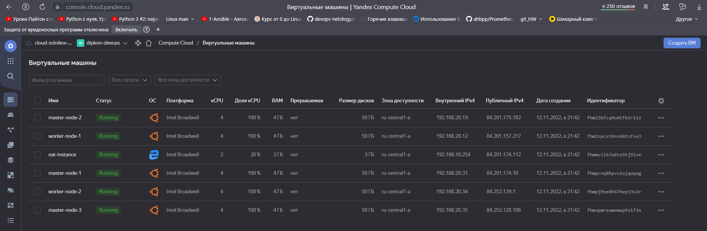
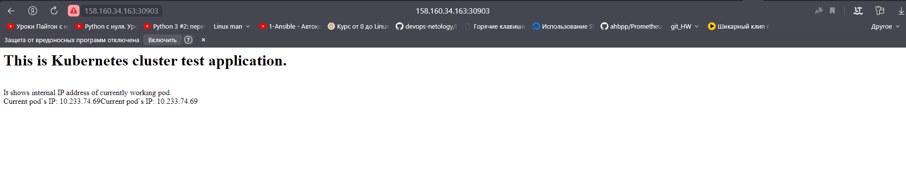
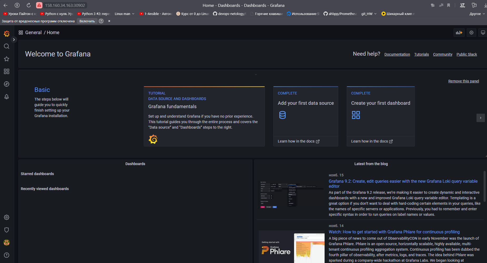
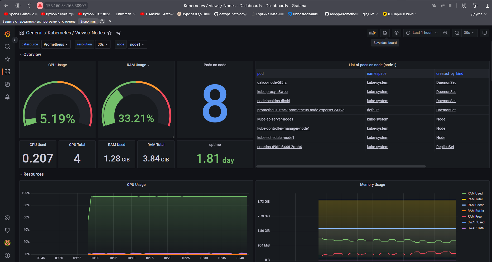
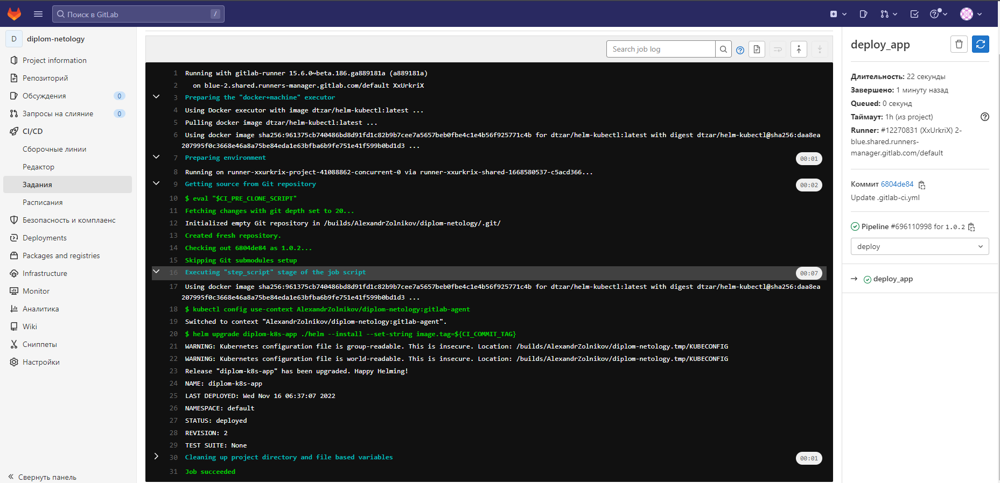
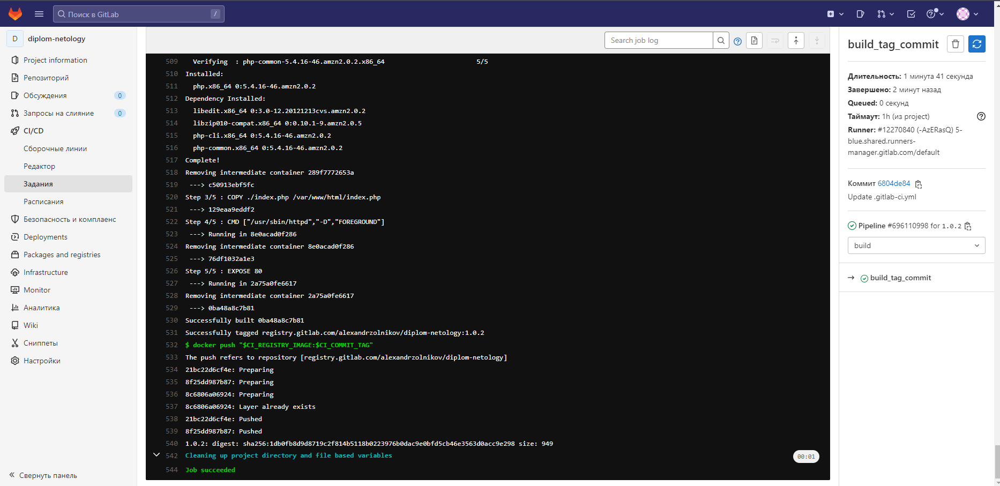
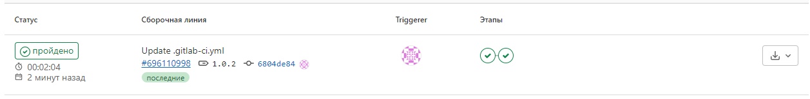

## Создание облачной инфраструктуры.
В качестве бекенда для Терраформа выбран Terraform Cloud.
#### Файл [main.tf](./terraform/main.tf)

#### Cоздаем workspace stage
````
$ terraform workspace new stage
Created and switched to workspace "stage"!

You're now on a new, empty workspace. Workspaces isolate their state,
so if you run "terraform plan" Terraform will not see any existing state
for this configuration.
````

#### Cоздаем workspace prod
````
$ terraform workspace new prod
Created and switched to workspace "prod"!

You're now on a new, empty workspace. Workspaces isolate their state,
so if you run "terraform plan" Terraform will not see any existing state
for this configuration.
````
````
$ terraform workspace select stage
````
#### Workspace list
````
$ terraform workspace list
  default
  prod
* stage
````

````
$ terraform apply
````
#### Yandex Cloud


## Создание Kubernetes кластера

Скачиваем репозиторий с Kubespray.

```shell
$ git clone https://github.com/kubernetes-sigs/kubespray
```
### Установка зависимостей
```shell
$ sudo pip3 install -r requirements.txt
```
#### Копирование примера в папку с нашей конфигурацией
```shell
$ cp -rfp inventory/sample inventory/cluster-diplom
```

#### Заполняем inventory.ini

```yaml
[all]
node1 ansible_host=84.201.174.10  # ip=10.3.0.1 etcd_member_name=etcd1
node2 ansible_host=84.201.175.182  # ip=10.3.0.2 etcd_member_name=etcd2
node3 ansible_host=84.252.128.186  # ip=10.3.0.3 etcd_member_name=etcd3
node4 ansible_host=84.201.157.217  # ip=10.3.0.4 etcd_member_name=etcd4
node5 ansible_host=84.252.129.1  # ip=10.3.0.5 etcd_member_name=etcd5

[kube_control_plane]
node1
node2
node3

[etcd]
node1
node2
node3

[kube_node]
node4
node5

[calico_rr]

[k8s_cluster:children]
kube_control_plane
kube_node
calico_rr
```

#### Запускаем плейбук.

```shell
$ ansible-playbook -i inventory/cluster-diplom/inventory.ini cluster.yml -b -v -e ansible_user=aleksandr
```

#### Подключаемся к мастеру и копируем содержимое файла `/etc/kubernetes/admin.conf`.

```shell
$ ssh aleksandr@158.160.34.163
```
```shell
aleksandr@node1:~$ mkdir -p $HOME/.kube
```

```shell
aleksandr@node1:~$ sudo cat /etc/kubernetes/admin.conf
apiVersion: v1
clusters:
- cluster:
    certificate-authority-data: LS0tL...0tCg==
    server: https://127.0.0.1:6443
  name: cluster.local
contexts:
- context:
    cluster: cluster.local
    user: kubernetes-admin
  name: kubernetes-admin@cluster.local
current-context: kubernetes-admin@cluster.local
kind: Config
preferences: {}
users:
- name: kubernetes-admin
  user:
    client-certificate-data: LS0tL...tLS0tCg==
    client-key-data: LS0tLS....0tLQo=
```

```shell
aleksandr@node1:~$ sudo cp -i /etc/kubernetes/admin.conf $HOME/.kube/config
```

```shell
aleksandr@node1:~$ sudo chown $(id -u):$(id -g) $HOME/.kube/config
```

#### Проверяем кластер.
```shell
aleksandr@node1:~$ kubectl get nodes
NAME    STATUS   ROLES           AGE    VERSION
node1   Ready    control-plane   2d4h   v1.25.4
node2   Ready    control-plane   2d4h   v1.25.4
node3   Ready    control-plane   2d4h   v1.25.4
node4   Ready    <none>          2d4h   v1.25.4
node5   Ready    <none>          2d4h   v1.25.4
```


## Создание тестового приложения

---

#### Ссылка на итоговый репозиторий с helm чартом.

[gitlab.com/AlexandrZolnikov/diplom-netology](https://gitlab.com/AlexandrZolnikov/diplom-netology)

---

#### Создадим докер-образ с простым веб-сервером, отдающим страницу c IP адресом пода, к которому было осуществлено подключение в данный момент.

#### Код приложения:

```php
<?php

$internal_ip = $_SERVER['SERVER_ADDR'];
echo "<h1>This is Kubernetes cluster test application.</h1><br>";
echo "It shows internal IP address of currently working pod.<br>";
echo "Current pod`s IP: $internal_ip";
?>
```

#### Докерфайл:

```dockerfile
FROM amazonlinux

RUN yum -y update \
    && yum -y install httpd \
    && yum -y install php

COPY ./index.php /var/www/html/index.php

CMD ["/usr/sbin/httpd","-D","FOREGROUND"]

EXPOSE 80
```

#### Для развертывания приложения в кластере созданы файлы deployment.yml, service.yml.

```yaml
---
#### deployment.yml
apiVersion: apps/v1
kind: Deployment
metadata:
  name: diplom-k8s-app
spec:
  replicas: 3
  selector:
    matchLabels:
      app: diplom-k8s-app
  template:
    metadata:
      labels:
        app: diplom-k8s-app
    spec:
      containers:
        - name: diplom-k8s-app
          image: aleksandrzol/diplom-k8s-app:1.0.0
          ports:
            - name: http
              containerPort: 80
              protocol: TCP
  
#### service.yaml
---
apiVersion: v1
kind: Service
metadata:
  name: diplom-k8s-app-svc
spec:
  type: NodePort
  selector:
    app: diplom-k8s-app
  ports:
    - name: web
      nodePort: 30903
      port: 80
      targetPort: 80
```

#### Запускаем сборку докер образа, и пушим образ в реджистри.

```shell
aleksandr@node1:~/app$ docker build -t diplom-k8s-app .

aleksandr@node1:~/app$ docker tag diplom-k8s-app:latest aleksandrzol/diplom-k8s-app:1.0.0

aleksandr@node1:~/app$ docker login

aleksandr@node1:~/app$ docker push aleksandrzol/diplom-k8s-app:1.0.0
```

#### Разворачиваем приложение в Кубернетесе и проверяем руезультат.

```shell
aleksandr@node1:~/app$ kubectl apply -f deployment.yml
aleksandr@node1:~/app$ kubectl apply -f service.yml
aleksandr@node1:~/app$ kubectl get po,svc -n gitlab-agent | grep diplom-k8s-app
pod/diplom-k8s-app-545686869d-9hdz4   1/1     Running   0          10h
pod/diplom-k8s-app-545686869d-cq5kd   1/1     Running   0          10h
pod/diplom-k8s-app-545686869d-pz9vd   1/1     Running   0          10h
service/diplom-k8s-app   NodePort   10.233.11.61   <none>        80:30903/TCP   10h
```



---

## Подготовка системы мониторинга и деплой приложения

---

Ддя создания системы мониторинга воспользуемся helm чартом из этого [репозитория](https://github.com/prometheus-community/helm-charts/tree/main/charts/kube-prometheus-stack).


```shell
aleksandr@node1:~/app$ helm repo add prometheus-community https://prometheus-community.github.io/helm-charts
aleksandr@node1:~/app$ helm repo update
aleksandr@node1:~/app$ helm install prometheus-stack  prometheus-community/kube-prometheus-stack
```

```shell
# Выводим список сервисов
aleksandr@node1:~/app$ kubectl get svc -w
NAME                                        TYPE        CLUSTER-IP      EXTERNAL-IP   PORT(S)                      AGE
alertmanager-operated                       ClusterIP   None            <none>        9093/TCP,9094/TCP,9094/UDP   10h
kubernetes                                  ClusterIP   10.233.0.1      <none>        443/TCP                      2d4h
prometheus-operated                         ClusterIP   None            <none>        9090/TCP                     10h
prometheus-stack-grafana                    ClusterIP   10.233.56.87    <none>        80/TCP                       10h
prometheus-stack-kube-prom-alertmanager     ClusterIP   10.233.1.26     <none>        9093/TCP                     10h
prometheus-stack-kube-prom-operator         ClusterIP   10.233.26.155   <none>        443/TCP                      10h
prometheus-stack-kube-prom-prometheus       ClusterIP   10.233.23.112   <none>        9090/TCP                     10h
prometheus-stack-kube-state-metrics         ClusterIP   10.233.56.209   <none>        8080/TCP                     10h
prometheus-stack-prometheus-node-exporter   ClusterIP   10.233.43.39    <none>        9100/TCP                     10h
```

#### Создаем манифест сервиса типа NodePort.

```yaml
# service-grafana.yaml
---
apiVersion: v1
kind: Service
metadata:
  name: grafana
spec:
  type: NodePort
  selector:
    app.kubernetes.io/name: grafana
  ports:
    - name: http
      nodePort: 30902
      port: 3000
      targetPort: 3000
```

#### Применяем конфигурацию.
```shell
aleksandr@node1:~/app$ kubectl apply -f service-grafana.yml
```

```shell
aleksandr@node1:~/app$ kubectl get svc
NAME                                        TYPE        CLUSTER-IP      EXTERNAL-IP   PORT(S)                      AGE
alertmanager-operated                       ClusterIP   None            <none>        9093/TCP,9094/TCP,9094/UDP   10h
grafana                                     NodePort    10.233.41.226   <none>        3000:30902/TCP               10h
kubernetes                                  ClusterIP   10.233.0.1      <none>        443/TCP                      2d4h
prometheus-operated                         ClusterIP   None            <none>        9090/TCP                     10h
prometheus-stack-grafana                    ClusterIP   10.233.56.87    <none>        80/TCP                       10h
prometheus-stack-kube-prom-alertmanager     ClusterIP   10.233.1.26     <none>        9093/TCP                     10h
prometheus-stack-kube-prom-operator         ClusterIP   10.233.26.155   <none>        443/TCP                      10h
prometheus-stack-kube-prom-prometheus       ClusterIP   10.233.23.112   <none>        9090/TCP                     10h
prometheus-stack-kube-state-metrics         ClusterIP   10.233.56.209   <none>        8080/TCP                     10h
prometheus-stack-prometheus-node-exporter   ClusterIP   10.233.43.39    <none>        9100/TCP                     10h
```

#### Проверяем доступность веб-интерфейса:





---
## Установка и настройка CI/CD

Для создания пайплайна для сборки и деплоя приложения выбран Gitlab CI/CD.

В репозиторий с ранее созданным приложением был добавлен helm chart.  
Ссылка на репозиторий: [gitlab.com/AlexandrZolnikov/diplom-netology](https://gitlab.com/AlexandrZolnikov/diplom-netology)


#### Установка агента Gitlab в Кубернетес

Для взаимодействия Gitlab CI/CD с кластером Kubernetes установим в него [gitlab агент](https://docs.gitlab.com/ee/user/clusters/agent/ci_cd_workflow.html).

Создадим файл конфига `.gitlab/agents/gitlab-agent/config.yaml`, в котором пропишем путь к проекту, к которому должен быть открыт доступ агенту.

```yaml
ci_access:
  projects:
    - id: alexandrzolnikov/diplom-netology
```

#### Устанавливаем агент в кластер с помощью helm:

```
helm repo add gitlab https://charts.gitlab.io \
helm repo update \
helm upgrade --install gitlab-agent gitlab/gitlab-agent \
     --namespace gitlab-agent \
     --create-namespace \
     --set image.tag=v15.6.0 \
     --set config.token=QNd4U6....Nzqc1Q \
     --set config.kasAddress=wss://kas.gitlab.com

```

В файле [`.gitlab-ci.yml`](https://gitlab.com/AlexandrZolnikov/diplom-netology/-/blob/main/.gitlab-ci.yml) настроен пайплайн для автоматической сборки и деплоя приложения.

При любом коммите создается новый докер образ и загружается в репозиторий gitlab. При создании нового тега создается образ, и из него с помошью helm деплоится новая версия приложения.

Ссылки на результаты успешных джоб: 

[сборки ](https://gitlab.com/AlexandrZolnikov/diplom-netology/-/pipelines)








#### Проверяем обновленный деплоймент и удостоверяемся, что он создан из образа с только что добавленным тегом:

```shell
aleksandr@node1:~/app$ kubectl describe deployment diplom-k8s-app --namespace gitlab-agent
Name:                   diplom-k8s-app
Namespace:              gitlab-agent
CreationTimestamp:      Wed, 16 Nov 2022 06:25:13 +0000
Labels:                 app.kubernetes.io/managed-by=Helm
Annotations:            deployment.kubernetes.io/revision: 2
                        meta.helm.sh/release-name: diplom-k8s-app
                        meta.helm.sh/release-namespace: default
Selector:               app=diplom-k8s-app
Replicas:               3 desired | 3 updated | 3 total | 3 available | 0 unavailable
StrategyType:           RollingUpdate
MinReadySeconds:        0
RollingUpdateStrategy:  25% max unavailable, 25% max surge
Pod Template:
  Labels:  app=diplom-k8s-app
  Containers:
   diplom-k8s-app:
    Image:        registry.gitlab.com/alexandrzolnikov/diplom-netology:1.0.2
    Port:         80/TCP
    Host Port:    0/TCP
    Environment:  <none>
    Mounts:       <none>
  Volumes:        <none>
Conditions:
  Type           Status  Reason
  ----           ------  ------
  Available      True    MinimumReplicasAvailable
  Progressing    True    NewReplicaSetAvailable
OldReplicaSets:  <none>
NewReplicaSet:   diplom-k8s-app-545686869d (3/3 replicas created)
Events:          <none>
```

## Дополнение:

[Grafana](http://158.160.34.163:30902)
login: `admin`
password: `prom-operator`

[Приложение](http://158.160.34.163:30903)

[Gitlab](https://gitlab.com/AlexandrZolnikov/diplom-netology/-/tree/main)
